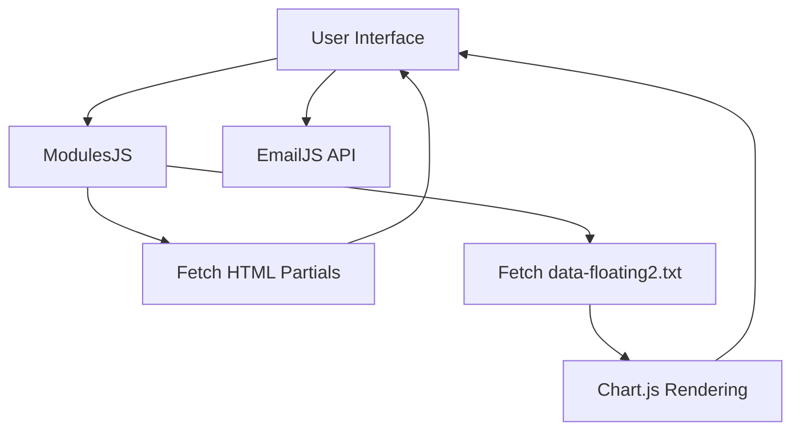

# Ibero Solar - Technical Assessment & Documentation

## 1. Project Title
Ibero Solar / LETS (Laboratorio de Energía Térmica Solar)

## 2. Project Overview
A web-based frontend application for monitoring air quality, sensor data, and presenting information about the LETS laboratory at Universidad Iberoamericana. The site displays real-time environmental data fetched from local text files, rendering graphs and metrics dynamically.

## 3. Objectives and Scope
The goal of this project is to provide a user-friendly interface to visualize meteorological and air quality data captured by sensors, while promoting the research initiatives of the LETS laboratory.

## 4. Key Features
- **Data Visualization**: Real-time graphing of air quality and meteorological data using Chart.js.
- **Dynamic HTML Modules**: Client-side rendering of common UI components (Navbar, Footer) using vanilla JS `fetch`.
- **Contact Form**: Email submission integration using EmailJS.
- **Animations**: Typing animations, carousels, and CSS-based earth/sunrise animations.

## 5. Technology Stack
- **Frontend**: HTML5, CSS3, Vanilla JavaScript, jQuery
- **Libraries**: Chart.js, EmailJS, Typed.js, Owl Carousel, SweetAlert2 (partially implemented)
- **Icons**: Font Awesome, Boxicons
- **Backend/Data**: Local text file (`data-floating2.txt`) acting as a data source. No traditional backend server/API implemented in this repository.

## 6. Architecture Overview
The project follows a static component-based architecture using vanilla JavaScript. HTML pages (`index.html`, `AirQuality.html`, `Sensors.html`) serve as entry points. Reusable components (Navbar, Footer, Modals) are stored in `ModulesHTML` and loaded asynchronously via JS fetch calls in `ModulesJS/modules.js`.

## 7. System Architecture Diagram

## 8. Project Directory Structure
See [docs/PROJECT_STRUCTURE.md](docs/PROJECT_STRUCTURE.md) for full details.

## 9. Prerequisites
- Any modern web browser
- Python 3 (for running a local HTTP server)

## 10. Installation & Running the Project
1. Clone the repository.
2. Open a terminal in the project root.
3. Start a local server: `python3 -m http.server`
4. Access the site at `http://localhost:8000`

## 11. Development Workflow
Modifications to the UI are done directly in the HTML/CSS files. Reusable elements like the navigation bar can be edited in `ModulesHTML/navbar.html`. 

## 12. Technical Debt and Future Improvements

**Update (Phase 1 Complete):**
- EmailJS configuration has been encapsulated.
- Global JavaScript scope has been isolated using IIFEs.
- Typography has been updated to modern fonts (`Inter` and `Montserrat`) for all sections except the Hero.

- Migration to a modern framework (e.g., React, Vue) or static site generator (e.g., Astro, Next.js) to avoid layout shifts caused by client-side `fetch` of HTML partials.
- Implementation of a real REST API instead of polling `data-floating2.txt`.
- Removal of unused dependencies (jQuery, if possible, as it's only used for the carousel and navbar toggling).

See [docs/TECHNICAL_DEBT.md](docs/TECHNICAL_DEBT.md) and [docs/IMPLEMENTATION_PLAN.md](docs/IMPLEMENTATION_PLAN.md) for detailed recommendations.
